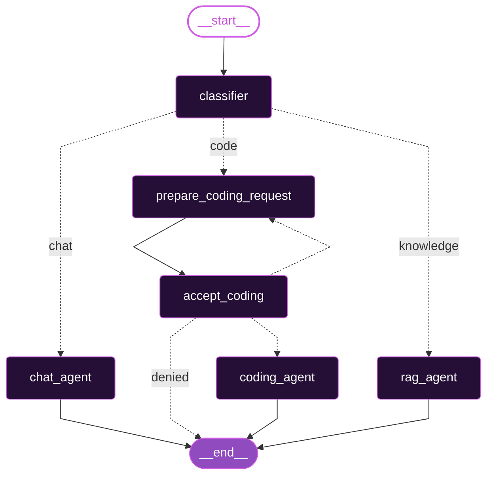

## Graph

```mermaid
---
config:
  flowchart:
    curve: linear
---
graph TD;
	__start__([__start__]):::first
	classifier[classifier]
	chat_agent[chat_agent]
	rag_agent[rag_agent]
	prepare_coding_request[prepare_coding_request]
	accept_coding[accept_coding]
	coding_agent[coding_agent]
	__end__([__end__]):::last

	__start__ --> classifier;

	classifier -. chat .-> chat_agent;
	classifier -. code .-> prepare_coding_request;
	classifier -. knowledge .-> rag_agent;

	prepare_coding_request --> accept_coding;

	accept_coding -. denied .-> __end__;
	accept_coding -.-> coding_agent;
	accept_coding -.-> prepare_coding_request;

	chat_agent --> __end__;
	coding_agent --> __end__;
	rag_agent --> __end__;

	classDef default fill:#250f36,stroke:#d05ce3,stroke-width:1px,color:#fff,rx:4px,ry:4px
	classDef first fill-opacity:0,stroke:#d05ce3,stroke-width:2px,color:#c84ddb
	classDef last fill:#904bbf,stroke:#d05ce3,stroke-width:1px,color:#fff
```