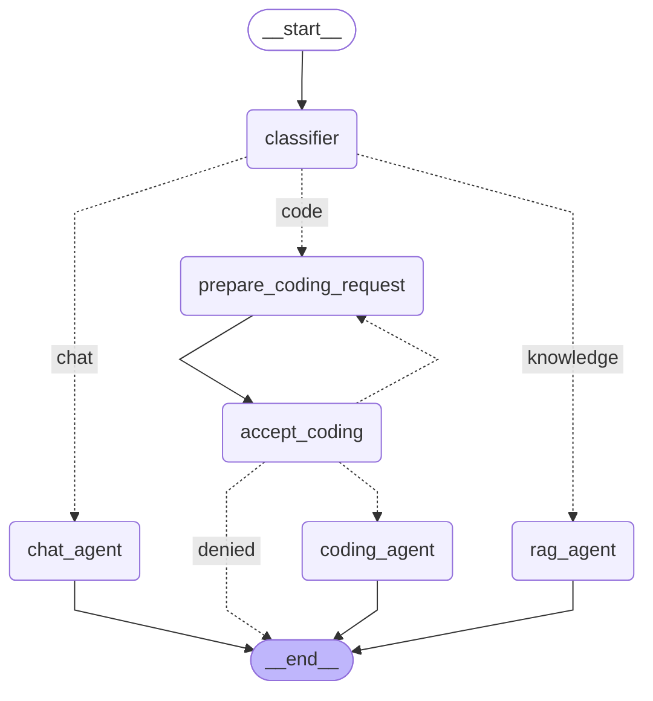

## Graph

```mermaid
---
config:
  flowchart:
    curve: linear
---
graph TD;
	__start__([<p>__start__</p>]):::first
	classifier(classifier)
	chat_agent(chat_agent)
	rag_agent(rag_agent)
	prepare_coding_request(prepare_coding_request)
	accept_coding(accept_coding)
	coding_agent(coding_agent)
	__end__([<p>__end__</p>]):::last
	__start__ --> classifier;
	accept_coding -. &nbsp;denied&nbsp; .-> __end__;
	accept_coding -.-> coding_agent;
	accept_coding -.-> prepare_coding_request;
	classifier -. &nbsp;chat&nbsp; .-> chat_agent;
	classifier -. &nbsp;code&nbsp; .-> prepare_coding_request;
	classifier -. &nbsp;knowledge&nbsp; .-> rag_agent;
	prepare_coding_request --> accept_coding;
	chat_agent --> __end__;
	coding_agent --> __end__;
	rag_agent --> __end__;
	classDef default fill:#f2f0ff,line-height:1.2
	classDef first fill-opacity:0
	classDef last fill:#bfb6fc
```